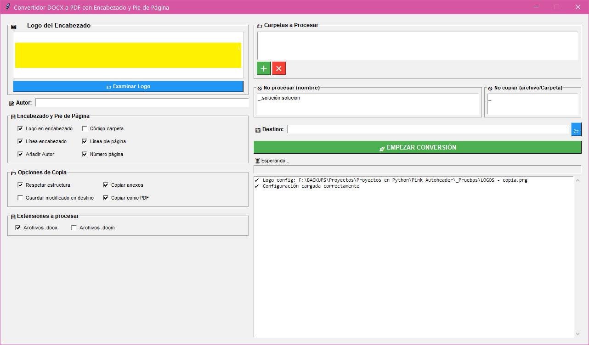

# Pink Autoheader

Aplicación de escritorio para Windows que automatiza la conversión masiva de documentos `.docx` (o `.docm`) a PDF, añadiendo encabezados personalizados (logo y código) y pies de página (autor y numeración).



## Características

- ✅ Procesamiento masivo de archivos `.docx` y `.docm`
- ✅ Inserción automática de logo en encabezado
- ✅ Añadir código de carpeta y autor
- ✅ Numeración automática de páginas
- ✅ Líneas decorativas en encabezado y pie de página
- ✅ Filtrado por palabras prohibidas
- ✅ Sistema de renombrado automático con código de carpeta
- ✅ Opción de mantener estructura de carpetas original
- ✅ Interfaz gráfica intuitiva con soporte drag & drop

## Requisitos

- Windows 10/11
- Microsoft Word (Versión de escritorio de Office 365)
- Python 3.7+

## Dependencias

```bash
pip install pywin32 psutil Pillow tkinterdnd2
```

## Estructura del Proyecto

```
autopdf/
├── main.py                 # Punto de entrada
├── config.ini              # Configuración persistente
└── src/
    ├── config.py           # Constantes y estilos
    ├── config_manager.py   # Gestión de config.ini
    ├── utils.py            # Utilidades generales
    ├── file_manager.py     # Operaciones de archivos
    ├── word_processor.py   # Procesamiento Word/PDF
    ├── gui.py              # Interfaz gráfica (Tkinter)
    └── controller.py       # Lógica de negocio (MVC)
```

## Uso

1. **Configurar opciones** de formato mediante checkboxes:
   - **Formato de página**:  [X] Logo,  [X] líneas decorativas,  [X] autor,  [X] código,  [X] numeración
   - **Opciones de carpeta**:  [X] Respetar estructura,  [X] copiar anexos,  [X] convertir a PDF, [X] Guardar modificado en destino
   - **Opciones de renombrado**:  [X] Renombrar con código de carpeta
   - **Extensiones**: Archivos `.docx` y `.docm`

2. **Configurar filtros** (opciones avanzadas):
   - **Archivos no procesables**: Lista de palabras que identifican archivos no procesables.
   - **Archivos/carpetas no copiables**: Lista de palabras que identifican elementos no copiables/renombrables (se ignoran completamente)

3. **Seleccionar carpetas de origen** mediante drag & drop o botón de selección

4. **Especificar carpeta de destino** para archivos procesados

5. Presionar **EMPEZAR** para iniciar el procesamiento

> **⚠️ Importante**: La aplicación requiere que Microsoft Word esté cerrado antes de iniciar el procesamiento.

## Sistema de Filtrado

La aplicación ofrece dos niveles de filtrado para controlar qué archivos se procesan:

### Filtro de Archivos No Procesables
Define archivos que **NO se procesan**. Los archivos categorizados como **NO PROCESABLES**:
- ❌ NO reciben encabezados, pies de página ni modificaciones de formato
- ❌ NO se convierten a PDF (Se considera PDF como parte del Formato)

### Archivos y Carpetas No Copiables/ignorados
Define archivos y carpetas que **se ignoran completamente**. Estos elementos:
- ❌ NO se copian a la carpeta de destino
- ❌ NO se procesan
- ❌ NO se renombran

**Ejemplo**: Si añades `borrador` a esta lista, tanto el archivo `borrador_final.docx` como la carpeta `borradores/` se ignorarán.

### Regla de Prioridad
Un archivo o carpeta que **NO** está en "No Copiables" puede ser:
- Procesado (si es `.docx`/`.docm` y no está en "No Procesables")
- Copiado como anexo (si está en "No Procesables" o es otro tipo de archivo)
- Renombrado (si la opción está activada)

## Sistema de Renombrado Automático

Cuando activas la opción **"Renombrar con código de carpeta"**, la aplicación añade automáticamente el código de la carpeta al principio del nombre de cada archivo.

### Funcionamiento

El sistema reconoce dos formas de trabajar:

**1. Detección Automática (archivos con patrón)**

Si un archivo tiene dos o más guiones, el sistema extrae automáticamente la parte del nombre que debe conservarse:

```
Carpeta: CAL-05-Geometría

DOC-13-Teoremas.docx       →  CAL-05-Teoremas.docx
MAT-10 - Ejercicios.pdf    →  CAL-05 - Ejercicios.pdf
01-02-Resumen.docx         →  CAL-05-Resumen.docx
```

**2. Entrada Manual (archivos sin patrón)**

Si un archivo tiene menos de dos guiones, la aplicación muestra un diálogo pidiendo que definas la raíz del nombre:

```
Carpeta: CAL-05-Geometría

Tareas.pdf          →  Pregunta al usuario  →  CAL-05-Tareas.pdf
01-solución.docx    →  Pregunta al usuario  →  CAL-05-solución.docx
```

### ¿Qué archivos se renombran?

Solo los archivos que **NO** están en la lista de "No Copiables". Esto incluye:
- Documentos Word procesables
- Documentos Word no procesables (pero copiables)
- Anexos (PDFs, imágenes, etc.)

### Casos Especiales

- **Archivo con código correcto**: Si `MAT-10-Teoría.pdf` está en la carpeta `MAT-10-Álgebra`, no se renombra (ya es correcto)
- **Código diferente**: Si `DOC-05-Resumen.docx` está en `MAT-10-Álgebra`, se renombra a `MAT-10-Resumen.docx`
- **Cancelar renombrado**: Puedes cancelar el renombrado de archivos individuales durante el proceso

## Flujo de Trabajo

1. Usuario configura logo, autor, palabras prohibidas y carpetas
2. Al pulsar EMPEZAR, la app verifica que Word esté cerrado
3. **Fase de Renombrado** (si está activado): Renombra archivos con el código de carpeta
4. **Fase de Procesamiento**: Procesa documentos Word según opciones seleccionadas
5. Genera resultados en carpeta destino

## Roadmap / TO DO

### Alta Prioridad
- [ ] **Refactorización**: Dividir archivos complejos (`word_processor.py`, `gui.py`, `controller.py`) en funciones modulares y subcarpetas

### Funcionalidades Pendientes
- [X] **Config.ini**: Guardar y cargar última carpeta destino automáticamente
- [X] **Sistema de renombrado automático**: Basado en código de carpeta para reorganización masiva
- [ ] **Exportar log**: Generar archivo `.txt` externo con historial de procesamiento
- [ ] **Arrastrar** carpeta de destino además del botón de buscarlo.

### Bugs Conocidos

## Licencia

Proyecto en desarrollo.

---

**Pink Autoheader** - Automatización de documentos simplificada